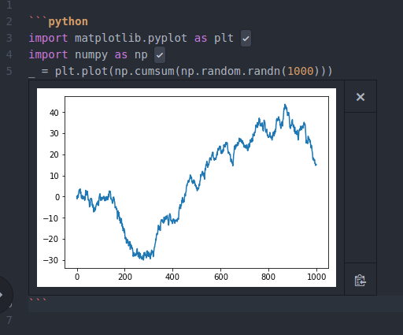

Editor support
==============

Atom
----
The recommended editor to use with Pweave is Atom. `language-weave <https://atom.io/packages/language-weave>`_
package has Pweave syntax highlighting for several markups and support running code
from chunks interactively using `Hydrogen <https://nteract.io/atom>`__.

You can use Hydrogen keybindings to run code e.g ``ctrl-enter`` to run a line and
``ctrl-alt-enter`` to run entire chunk.

Install from Atom or using apm:

::

    apm install language-weave Hydrogen

To install packages that I find useful for preview and formatting run:

::

    apm install language-markdown atom-html-preview pdf-view

And for terminal support connected to Hydrogen kernel:

::

    apm install hydrogen-launcher platformio-ide-terminal

  Pweave syntax highlighting in Atom and output from Hydrogen.

Spyder
------

Another good option is to use a Spyder plugin called `Spyder reports <https://github.com/spyder-ide/spyder-reports>`__
that can render Pweave documents inside Spyder.

Pweave can also publish scipts using Spyder cell format with
``#%%`` `code cell mark up <https://pythonhosted.org/spyder/editor.html#how-to-define-a-code-cell>`_ .

Emacs
-----

You can use Emacs with noweb-mode. I use .prstw for Pweave documents written
with reST markup and .ptexw for LaTeX markup. Here is what I have in my ~/.emacs.d/init.el
to make Emacs recognize my Pweave documents correctly.

::

   ;Pnw-mode for Pweave reST documents
   (defun Pnw-mode ()
     	  (require 'noweb-font-lock-mode)
          (noweb-mode)
	  (setq noweb-default-code-mode 'python-mode)
          (setq noweb-doc-mode 'rst-mode))

   (setq auto-mode-alist (append (list (cons "\\.prstw$" 'rstw-mode))
		      auto-mode-alist))

   ;Plw-mode for Pweave Latex documents
   (defun Plw-mode ()
   	  (require 'noweb-font-lock-mode)
  	  (noweb-mode)
   	  (setq noweb-default-code-mode 'python-mode)
  	  (setq noweb-doc-mode 'latex-mode))

   (setq auto-mode-alist (append (list (cons "\\.ptexw$" 'texw-mode))
		      auto-mode-alist))

The code simply sets the documentation mode (*noweb-doc-mode as rst-mode*) as reStructuredText or
LaTeX depending on the extension and the code mode as Python, so that the code chunks
will be correctly formatted.

VIM
---

Pweave VIM plugin: `<https://github.com/coyotebush/vim-pweave>`__ .
