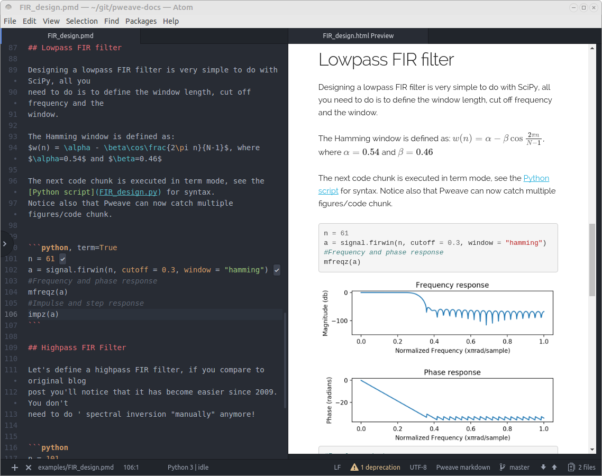

Pweave - Scientific Reports Using Python
========================================

Pweave is a scientific report generator and a literate programming
tool for Python. Pweave can capture the results and plots from data
analysis and works well with NumPy, SciPy and matplotlib. It is able to run
python code from source document and include the results and capture
`matplotlib <http://matplotlib.org/>`_ plots in the output.

.. note::

  Pweave 0.30 has been updated to use IPython to run code from the documents.
  This brings support for IPython magics and rich output and support for other.

Features:
---------

* Python 3.4, 3.5 and 3.6 compatibility
* **Execute python code** in the chunks and **capture** input and output to a report.
* Rich output and support for IPython magics
* **Use hidden code chunks,** i.e. code is executed, but not printed in the output file.
* Capture matplotlib graphics.
* Evaluate inline code in documentation chunks marked using ``<% %>`` and ``<%= %>``.
* Cache all code and results from previous runs for fast report
  generation when you are only working with documentation. Inline code
  will be hidden in documentation mode.
* Publish reports from Python scipts. Similar to R markdown.
* Run from command line or interpreter.
* Execute code using any Jupyter kernel.
* Pweave 0.30 works on Python 3 only, but you can use Python 2 run the code via
  `kernel` argument.

  Pweave markdown document in Atom together with output. Atom support using ``language-weave``-package.

.. note::

   Report bugs on `Github <https://github.com/mpastell/Pweave>`_.
   Post your questions and comments to `Pweave <https://groups.google.com/forum/?fromgroups=#!forum/pweave>`_
   google group.

Install and quickstart:
-----------------------

with pip::

  pip install --upgrade Pweave

with conda::

  conda install pweave -c conda-forge

After the installation you get options with:

::

  $ pweave --help
  $ ptangle

Documentation
-------------

Browse `documentation <docs.html>`_ or go straight to an `examples <examples/index.html>`_

Thanks
------

Pweave was originally inspired by `Sweave <http://www.stat.uni-muenchen.de/~leisch/Sweave/>`_, an excellent tool
for R programmers. The current version has also been influenced by ideas from `knitr <http://yihui.name/knitr/>`_
and `R markdown <http://rmarkdown.rstudio.com/>`_.

Thanks to following people for contributing patches and ideas: Jakub Kowalski, Tamas
Nepusz, Nicky van Foreest, Mark Edgington, Thomas Unterthiner, Matthew
McDonald, Grant Goodyear, Aaron O'Leary, Thomas Saunders and contributors on Github
https://github.com/mpastell/Pweave/graphs/contributors.
